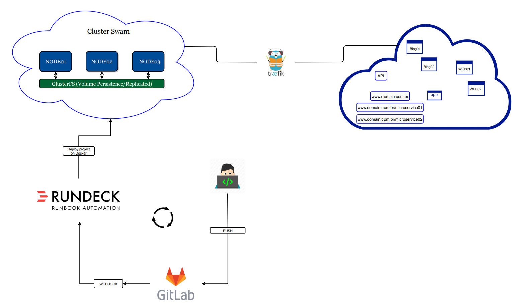

# Continuous Deploy com Docker Swarm
    ### Aqui será abordado de forma teorica sem o intuito de demonstrar um tutorial sobre o projeto em questão em que desenvolvi.
#

## Aplicacãoes utilizadas e suas respectivas funcionalidades e funçoes dentro do projeto:

* #### **Docker Swarm:** Conjunto de servidores para funcionamento de um Cluster Docker Swarm que consiste em 3 servidores onde é possível garantir LoadBalance e Alta Disponibilidade entre os serviços em funcionamento nele. Por exemplo:  Vamos teorizar que uma aplicação web estivesse em Docker Swarm, então criaremos um serviço dessa aplicação que consistiria em configurar e adaptar ela ao Docker, com o serviço criado escalaremos ele para 6, logo haverá 6 containers idênticos com a aplicação web espalhados uniformemente entre os 3 nós do Swarm, sendo assim, caso o nó 03 caia, ainda haveria os nós 01 e 02 disponíveis com a aplicação web que não seria afetada pela queda do nó 03 garantindo assim a disponibilidade da aplicação web, além de promover um LoadBalance que consistiria em distribuir as requisições entre os containers do serviço contido nos nós evitando então uma carga elevada em apenas um ponto. E para se ter uma estrutura automatizada há um conjunto de aplicações que será explicadas a baixo:

* #### **Traefik:** É um proxy reverso capaz de viabilizar o LoadBalance e ajudar na Alta Disponibilidade dos serviços rodando em Docker, no qual, é a porta que intercepta e roteia todas as solicitações recebidas: conhece toda a lógica e todas as regras que determinam quais serviços tratam de quais solicitações (com base no caminho , no host , cabeçalhos , e assim por diante ...).

* #### **Rundeck:** É uma ferramenta de automação de rotinas, que em nossa estrutura fornece a função de criação automátizada e contínua de serviços a partir de um _git push_ feito por um Dev no Gitlab. Assim criando um serviço no Docker Swarm conrrespondente a um projeto no Gitlab.

* #### **Glusterfs** É um software de escalabilidade de armazenamento, sendo o responsável por distribuir e persistir os dados dos _volumes_ utilizados e criados pelos serviços entre os nós do Docker Swarm.

A figura a seguir mostra a arquitetura do projeto: 
     

### **Workflow:**  
